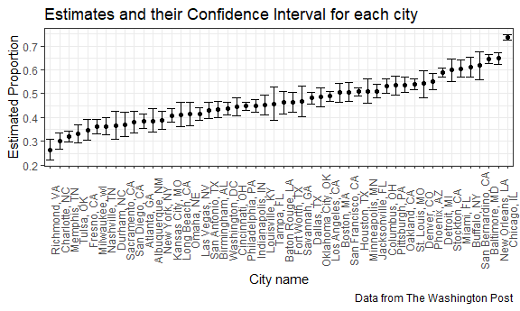

P8105\_HW5
================
Abhishek Ajay (aa4266)
November 9, 2018

Problem 1
---------

Here we import the participant data and tidy it using the concepts learnt in Data Wrangling I and iterations.

``` r
path = str_c("./data/", list.files("./data/")) 
file_name = list.files("./data/")

vec_file_name = 
  tibble( 
    path = path[1:20], 
    file_name = file_name[1:20]
)

pcpt_data_tidy =
  purrr::map_df(vec_file_name$path, read_csv) %>% 
  unnest() %>% 
  cbind(file_name = vec_file_name$file_name) %>% 
  separate(file_name, into = c("arm", "id"), sep = "_") %>% 
  separate(id, into = c("id", "remove"), sep = 2) %>% 
  #select(arm, id, week_1:week_8) %>% 
  gather(key = week, value = obsv, week_1:week_8) %>% 
  separate(week, into = c("remove", "week_no"), sep = '_') %>% 
  select(arm, id, week_no, obsv)
```

Now we make a spaghetti plot showing observations on each subject over time, and comment on differences between groups.

``` r
pcpt_data_tidy %>% 
  ungroup() %>% 
  mutate(arm_id = paste(arm, id, sep = "_")) %>% 
  ggplot(aes(x = week_no, y = obsv, color = arm, group = arm_id)) +
    geom_line() +
    labs(
      title = "Observations on each subject over time",
      x = "Week Number",
      y = "Observation",
      color = 'Arm'
    ) 
```


As can be observed, with the weeks go by, the experimental observation values increase. However, the control observation values are lower and within the same range of values all through the weeks.

Problem 2
---------

### Data Description

The dimensions of the raw data are: 52179, 12

The variables in the raw data are: uid, reported date, victim's last name and first name, victim's race, age, sex, city, state, latitude, longitude and disposition.

The first report was on 1st January, 2007 and 31st December 2017. There are 2 probably incorrect date entries for uid: Mia-000652 and Mia-000649.

Mutating the raw data.

``` r
homicide_data_mutate_total = 
  homicide_data %>% 
  mutate(city_state = paste(city, state, sep = ", "), disposition = as.factor(disposition)) %>%
  group_by(city_state) %>% 
  summarise(n_homicides = n())

homicide_data_mutate_unsolved = 
  homicide_data %>% 
  ungroup() %>% 
  mutate(city_state = paste(city, state, sep = ", "), disposition = as.factor(disposition)) %>%
  filter(disposition != "Closed by arrest") %>% 
  group_by(city_state) %>% 
    summarise(n_unsolved_homicides = n())

# The city, Tulsa is ignored in the join since its unsolved homicides' NA.
homicide_data_mutate = 
  full_join(homicide_data_mutate_total, homicide_data_mutate_unsolved) %>% 
  filter(!is.na(n_unsolved_homicides))
```

    ## Joining, by = "city_state"

Finding an estimate to the proportion of homicides that are unsolved for the city of **Baltimore, MD**

``` r
proportion_baltimore =
  homicide_data_mutate %>%
  filter(city_state == "Baltimore, MD") 
  
prop.test(proportion_baltimore$n_unsolved_homicides, proportion_baltimore$n_homicides) %>% 
  broom::tidy() %>% 
  select(estimate, conf.low, conf.high) %>% 
  mutate(conf.int = conf.high - conf.low) %>% 
  knitr::kable()
```

|   estimate|   conf.low|  conf.high|   conf.int|
|----------:|----------:|----------:|----------:|
|  0.6455607|  0.6275625|  0.6631599|  0.0355974|

Finding the same proportion for each city using iterations.

``` r
prop.test_city = function(x){
  proportion_city = 
    homicide_data_mutate %>% 
    filter(city_state == x)
  
  prop.test(proportion_city$n_unsolved_homicides, proportion_city$n_homicides) %>% 
  broom::tidy() %>% 
  select(estimate, conf.low, conf.high) %>% 
  mutate(conf.int = conf.high - conf.low)
}

proportion_all_cities = 
  map(homicide_data_mutate$city_state, prop.test_city) %>% 
  mutate(homicide_data_mutate, data = .) %>% 
  unnest()
```

Making a plot here to display the CIs and estimates for each city.

``` r
proportion_all_cities %>% 
  mutate(city_state = as.factor(city_state)) %>%
  mutate(city_state = fct_reorder(city_state, estimate)) %>% 
  ggplot(aes(x = city_state, y = estimate, ymin = conf.low, ymax = conf.high)) +
  geom_point() + geom_errorbar() +
  labs(
    title = "Estimates and their Confidence Interval for each city",
    x = "City name", 
    y = "Estimated Proportion", 
    caption = "Data from The Washington Post"
  ) +
  theme(axis.text.x = element_text(angle = 90))
```


