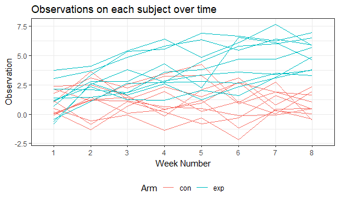

P8105\_HW5
================
Abhishek Ajay (aa4266)
November 9, 2018

Problem 1
---------

Here we import the participant data and tidy it using the concepts learnt in Data Wrangling I and iterations.

``` r
path = str_c("./data/", list.files("./data/")) 
file_name = list.files("./data/")

vec_file_name = 
  tibble( 
    path = path[1:20], 
    file_name = file_name[1:20]
)

pcpt_data_tidy =
  purrr::map_df(vec_file_name$path, read_csv) %>% 
  unnest() %>% 
  cbind(file_name = vec_file_name$file_name) %>% 
  separate(file_name, into = c("arm", "id"), sep = "_") %>% 
  separate(id, into = c("id", "remove"), sep = 2) %>% 
  #select(arm, id, week_1:week_8) %>% 
  gather(key = week, value = obsv, week_1:week_8) %>% 
  separate(week, into = c("remove", "week_no"), sep = '_') %>% 
  select(arm, id, week_no, obsv)
```

Now we make a spaghetti plot showing observations on each subject over time, and comment on differences between groups.

``` r
pcpt_data_tidy %>% 
  ungroup() %>% 
  mutate(arm_id = paste(arm, id, sep = "_")) %>% 
  ggplot(aes(x = week_no, y = obsv, color = arm, group = arm_id)) +
    geom_line() +
    labs(
      title = "Observations on each subject over time",
      x = "Week Number",
      y = "Observation",
      color = 'Arm'
    ) 
```



As can be observed, with the weeks go by, the experimental observation values increase. However, the control observation values are lower and within the same range of values all through the weeks.

Problem 2
---------

### Data Description

The dimensions of the raw data are: 52179, 12

The variables in the raw data are:

| x              |
|:---------------|
| uid            |
| reported\_date |
| victim\_last   |
| victim\_first  |
| victim\_race   |
| victim\_age    |
| victim\_sex    |
| city           |
| state          |
| lat            |
| lon            |
| disposition    |
